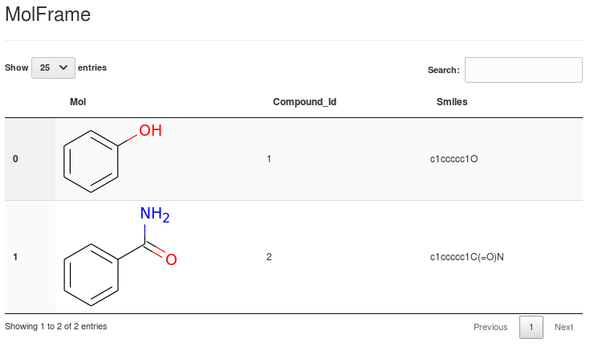
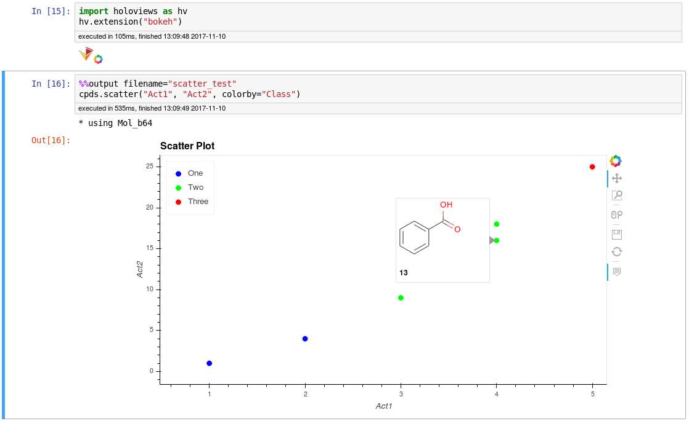
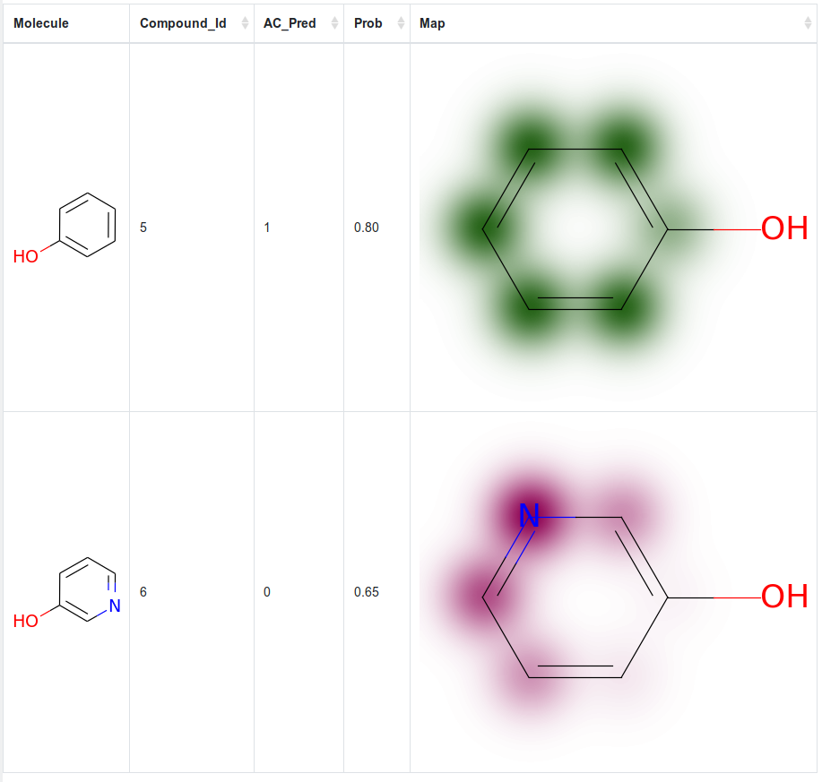

# MolFrames

Working with Pandas DataFrames that can handle chemical structures.  

**[Update 30-May-2018]**: The module has been rewritten again and the Dask functionality has been removed again because it was too limiting. If you want to continue using Dask, please switch to the `dask` branch.
Large datasets which do not fit in memory can either be first parsed and pre-filtered with the pipeline module of this project or be pre-processed with a pure dask dataframe, like this:

```Python
import dask.dataframe as dd
ddf = dd.read_csv("mylargedataset.csv")
# Pre-filtering by columns that are already present in the dataset:
ddf = ddf[(ddf["LogP"] < 5.0) & (ddf["MW"] < 500.0)]
ddf = ddf.compute()
```

and then imported into a Mol_Frame:
```Python
from mol_frame import mol_frame as mf
molf = mf.Mol_Frame()
molf.data = ddf
```

## Module Mol_Frame

Operations on molecules. For long operations, this displays a progress bar in the Notebook.

Output as sortable and optionally selectable HTML Tables:
  
(this is an extension of bluenote10's NimData [html browser](https://github.com/bluenote10/NimData/blob/master/src/nimdata/html.nim) 
which uses JQuery Datatables.)

Interactive HoloViews plots with structure tooltips:



## Module Pipeline

A Pipelining Workflow using Python Generators, mainly for RDKit and large compound sets.
The use of generators allows working with arbitrarily large data sets, the memory usage at any given time is low.

Example use:
```Python
from mol_frame import pipeline as p
s = p.Summary()
rd = p.start_csv_reader(test_data_b64.csv.gz", summary=s)
b64 = p.pipe_mol_from_b64(rd, summary=s)
filt = p.pipe_mol_filter(b64, "[H]c2c([H])c1ncoc1c([H])c2C(N)=O", summary=s)
p.stop_sdf_writer(filt, "test.sdf", summary=s)
```

or, using the pipe function:
```Python
from mol_frame import pipeline as p
s = p.Summary()
p.pipe((p.start_sdf_reader("test.sdf", {"summary": s})),
     p.pipe_keep_largest_fragment,
     (p.pipe_neutralize_mol, {"summary": s}),
     (p.pipe_keep_props, ["Ordernumber", "NP_Score"]),
     (p.stop_csv_writer, "test.csv", {"summary": s})
    )
```

The progress of the pipeline is displayed as a HTML table in the Notebook and can also be followed in a separate terminal with: `watch -n 2 cat pipeline.log`.

### Currently Available Pipeline Components:

| Starting                   | Running                    | Stopping
|----------------------------|----------------------------|---------------------------|
| start_cache_reader         | pipe_calc_props            | stop_cache_writer         |
| start_csv_reader           | pipe_custom_filter         | stop_count_records        |
| start_mol_csv_reader       | pipe_custom_man            | stop_csv_writer           |
| start_sdf_reader           | pipe_do_nothing            | stop_df_from_stream       |
| start_stream_from_dict     | pipe_has_prop_filter       | stop_dict_from_stream     |
| start_stream_from_mol_list | pipe_id_filter             | stop_mol_list_from_stream |
|                            | pipe_inspect_stream        | stop_sdf_writer           |
|                            | pipe_join_data_from_file   |                           |
|                            | pipe_keep_largest_fragment |                           |
|                            | pipe_keep_props            |                           |
|                            | pipe_merge_data            |                           |
|                            | pipe_mol_filter            |                           |
|                            | pipe_mol_from_b64          |                           |
|                            | pipe_mol_from_smiles       |                           |
|                            | pipe_mol_to_b64            |                           |
|                            | pipe_mol_to_smiles         |                           |
|                            | pipe_murcko_smiles         |                           |
|                            | pipe_calc_fp_b64           |                           |
|                            | pipe_neutralize_mol        |                           |
|                            | pipe_remove_props          |                           |
|                            | pipe_remove_dups           |                           |
|                            | pipe_rename_prop           |                           |
|                            | pipe_sim_filter            |                           |
|                            | pipe_sleep                 |                           |


Limitation: unlike in other pipelining tools, because of the nature of Python generators, the pipeline can not be branched. You can use the `stop_cache_writer` to use results in multiple pipelines.


## Module SAR

Currently implements a RandomForestClassifier and offers SimilarityMap visualization as shown in the RDKit [Cookbook](http://www.rdkit.org/docs/Cookbook.html#using-scikit-learn-with-rdkit):



Please also have a look at the `sar_example` notebook in the [tutorials](./tutorials) folder.

## Requirements
The recommended way to install the dependencies is via [conda](https://www.anaconda.com/download/).
* Python 3
* Jupyter Notebook
* [RDKit](http://rdkit.org/)
* [Dask](https://dask.pydata.org/)
* [HoloViews](http://holoviews.org/) (optionally, used for plotting)

The code is written and tested on Ubuntu 20.04 and Python 3.9 and is intended for use in the Jupyter Notebook.  
It also works in JupyterLab, but the custom javascript progress bars are then not displayed (yes, I probably should have used `tqdm`, but I didn't).

The main class is the MolFrame, which is a wrapper around a Pandas dataframe, exposing all DataFrame methods and extending it with some chemical functionality from the RDKit.  
The underlying DataFrame is contained in the MolFrame.data object and can always be accessed directly, if necessary.

See the accompanying [Tutorial](tutorials/tutorial1.ipynb) notebook for further examples.

## Installation
### Manually (preferred (by me))
After installing the requirements, clone this repo, then the module can be used by including the project's base directory (mol_frame) in Python's import path (I actually prefer this to using setuptools, because a simple git pull will get you the newest version).
This can be achieved as follows:

Put a file with the extension `.pth`, e.g. `my_packages.pth`, into one of the `site-packages` directories of your Python installation (e.g. `~/anaconda3/envs/chem/lib/python3.6/site-packages/`) and put the path to the base directory of this project (mol_frame) into it.
(I have the path to a dedicated folder on my machine included in such a .pth file and link all my development projects to that folder. This way, I need to create / modify the .pth file only once.)

### Setuptools
Upon request, a `pip`-installable package was also created.  

Either clone the repo, cd into it and issue:

```
pip install .
```
Or install directly from Github:

```
pip install git+https://github.com/apahl/mol_frame
```

## Disclaimer
This is work in progress and AFAIA currently mainly used by me, compatibility-breaking changes will happen.
